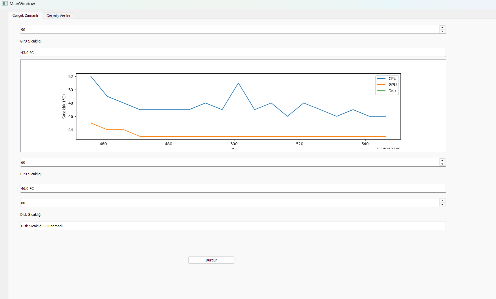
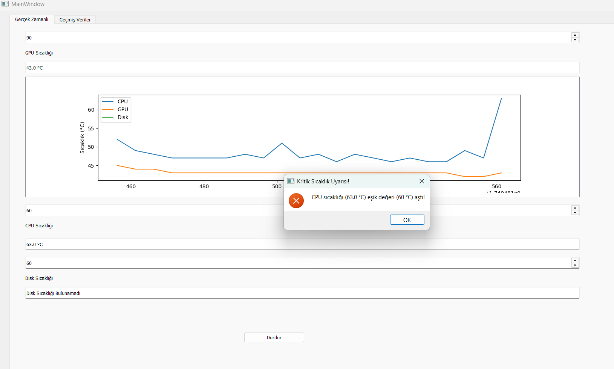
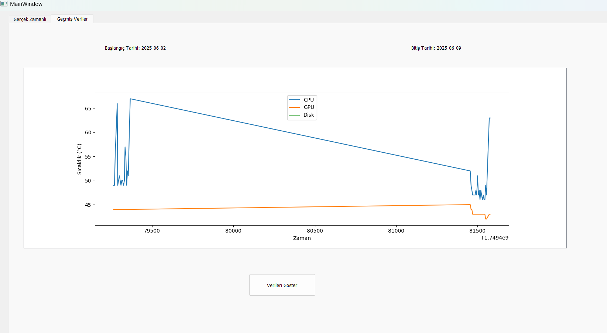

<h1 align="center"> Sıcaklık İzleme ve Uyarı Sistemi</h1>

  
  
  

---

##  Proje Hakkında

Bu Python tabanlı masaüstü uygulama, **CPU, GPU ve disk sıcaklıklarını gerçek zamanlı olarak izler.**  
Kullanıcının belirlediği eşik sıcaklıklar aşıldığında **alarm sesi çalar ve uyarı mesajı gösterilir.**  
Ayrıca geçmiş veriler **SQLite veritabanına kaydedilir** ve tarih aralığına göre grafiksel olarak görüntülenebilir.

---

##  Özellikler

-  PyQt5 ile kullanıcı dostu arayüz
-  OpenHardwareMonitor ile anlık donanım sıcaklık okuma
-  Eşik aşımlarında sesli uyarı ve mesaj kutusu
-  SQLite ile geçmiş verileri kaydetme
-  Tarihe göre grafik çizimi (matplotlib)

---

## 🖼️ Arayüz Görüntüleri

Uygulamanın grafik arayüzü PyQt5 kullanılarak tasarlanmıştır. Gerçek zamanlı sıcaklık izleme, eşik kontrolü, alarm sistemi ve geçmiş verilerin grafiksel analizi gibi işlevler kullanıcı dostu bir arayüzle sunulmaktadır.

###  Gerçek Zamanlı Sıcaklık Takibi

Bu ekranda kullanıcı, anlık olarak **CPU, GPU ve Disk sıcaklıklarını** görebilir. Her donanım bileşeni için eşik değeri ayarlanabilir. Sıcaklık değeri eşik değerini aşarsa uygulama otomatik olarak **uyarı verir ve sesli alarm** başlatır.

###  Uyarı Geldiğinde

Sıcaklık değerlerinden herhangi biri tanımlanan eşik değerin üzerine çıkarsa, uygulama kullanıcıyı hem **görsel mesaj kutusu** hem de **sistem sesi** ile uyarır. Bu, donanıma zarar gelmesini önlemek için kullanıcıya hızlı aksiyon alma imkânı tanır.

###  Geçmiş Verilerin Grafiği

Kullanıcılar tarih aralığı seçerek geçmişe dönük sıcaklık verilerini grafik olarak inceleyebilir. Bu sayede uzun vadede sistemin termal performansı takip edilebilir. Tüm veriler SQLite veritabanında saklanır.

---

##  Kurulum ve Gereksinimler

### 1. Python Gereksinimi
Uygulama Python 3.8+ ile test edilmiştir.  
Python yüklü değilse [python.org](https://www.python.org/downloads/) adresinden indirip kurabilirsiniz.

### 2. Gerekli Python Kütüphaneleri

Terminal veya CMD üzerinden aşağıdaki komutu çalıştırarak gerekli kütüphaneleri yükleyin:

pip install pyqt5 matplotlib wmi

### 3. OpenHardwareMonitor (v0.9.1) Kurulumu
Donanım sıcaklıklarını okuyabilmek için aşağıdaki adımları izleyin:

- openhardwaremonitor yüklü değilse [openhardwaremonitor.org](https://openhardwaremonitor.org/downloads/) adresinden indirip kurabilirsiniz.
- UYARI:  Bu uygulama yalnızca v0.9.1 sürümü ile doğru çalışmaktadır. Diğer sürümlerde WMI sensörleri Python tarafından algılanamayabilir.
- ZIP dosyasını çıkarın.
- OpenHardwareMonitor.exe dosyasını çalıştırın.
- Uygulama açık kaldığı sürece Python uygulaması sensörlere erişebilir.

### 4. Veritabanı Görüntüleme (Opsiyonel)
Kayıt edilen sicakliklar.db dosyasını görüntülemek isterseniz:

- SQLite yüklü değilse [SQLite.org](https://sqlitebrowser.org/dl/) adresinden indirip kurabilirsiniz.
- Veritabanını açarak geçmiş sıcaklık verilerini inceleyebilirsiniz

### 5. Uygulamayı Başlatma

- python sicaklik_uygulamasi.py 

python terminalinde çalıştırın

### PyQt5 Arayüzü Hakkında

Bu uygulama, kullanıcı arayüzü için PyQt5 kullanmaktadır.
Arayüz, .ui formatında Qt Designer aracı ile hazırlanmıştır.

İlgili dosyalar:
- sicaklik_arayuzu.ui → Qt Designer ile tasarlanmış grafik arayüz
- sicaklik_arayuzu.py → .ui dosyasından otomatik üretilmiş Python kodu

Arayüzü düzenlemek isterseniz:
sicaklik_arayuzu.ui dosyasını Qt Designer ile açabilirsiniz

Düzenlemeyi tamamladıktan sonra aşağıdaki komut ile .py dosyasına dönüştürün:

- pyuic5 -x sicaklik_arayuzu.ui -o sicaklik_arayuzu.py

pyuic5 komutu çalışmıyorsa PyQt5’in yüklü olduğundan emin olun:

- pip install pyqt5

---

## Veritabanı Yapısı

| Alan Adı       | Tür     | Açıklama                  |
| -------------- | ------- | ------------------------- |
| id             | INTEGER | Otomatik artan ID         |
| tarih          | TEXT    | Ölçüm tarihi (yyyy-MM-dd) |
| saat           | TEXT    | Ölçüm saati (HH\:mm\:ss)  |
| cpu\_sicaklik  | REAL    | CPU sıcaklığı (°C)        |
| gpu\_sicaklik  | REAL    | GPU sıcaklığı (°C)        |
| disk\_sicaklik | REAL    | Disk sıcaklığı (°C)       |

### Platform Uyarısı
- Bu uygulama sadece Windows işletim sistemi üzerinde çalışmaktadır.
- Linux/macOS desteği yoktur.

---

##  Katkı ve Geri Bildirim
- Bu projeyi geliştirip katkı sağlamak isterseniz pull request açabilir veya önerilerinizi issue olarak bildirebilirsiniz.
- Yıldız vererek destek olabilirsiniz! ⭐